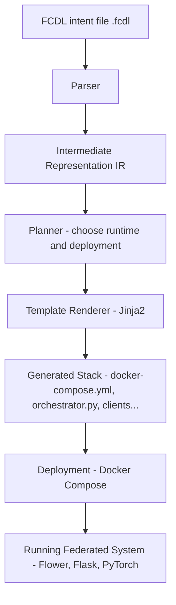

# FCDL 1.0  — Federated Services: From Intent to Implementation 📦🚀

  
>  **Status:** research proof-of-concept *from intent to implementation*

>  **Scope:** shows that a Federated Computing Description Language (FCDL) file can be *compiled* into a runnable Flower-based federated system with node registry, simple policy,
round-based scheduling and live metrics. 


---
# 🧭 ** Federated Learning PoC**

This project delivers a **functional Proof of Concept (PoC)** for **Federated Learning (FL)** built entirely using the principles of [Federated Computing (FC)](https://papers.ssrn.com/sol3/papers.cfm?abstract_id=5218039) — a modular, AI-oriented architectural paradigm for data governance, distributed intelligence, and scalable collaboration.
> The **PoC:**  seeks to implement a Federated Learning system using MNIST dataset on two nodes but following the principles of Federated Computing.

## ✅ What Was Built

We implemented a federated learning system composed of:

-   **Two FL nodes**, each training on isolated (non-IID) subsets of the MNIST dataset. One node uses only even digits and the other only odd digits.
    
-   A **central orchestrator**, which coordinates model training rounds, aggregates updates, and manages the lifecycle
    
-   A **intent configuration file** (`.fcdl` file), interpreted by a compiler to plan and execute the full system architecture
    

## 🧠 Why It Matters

Unlike traditional federated learning demos, this PoC:

-   Uses **modular, composable services** (Flask + Docker) instead of monolithic simulation frameworks
    
-   **Separates orchestration logic** from implementation, enabling reusability and scale
    
-   Aligns with emerging data governance challenges: privacy, transparency, interoperability, and modular compliance
    

## 🔬 What Was Demonstrated

-   **End-to-end federated training pipeline**, including orchestration, model aggregation (FedAvg), and weight synchronization
    
-   **REST API** to observe local learning dynamics, status, monitoring, and make predictions
    
-   Successful integration of **open-source ML tools** into a federated system without requiring custom infrastructure
    
-   Observed real-world challenges (non-IID divergence, overfitting) and tested mitigation strategies
    

## 🌐 🌟 What’s in here?

| Layer | Implementation in this PoC |
| ----------------------------------- | -------------------------- |
| **Intent language** | `examples/mnist_basic.fcdl` written in FCDL v1.1 |
| **Compiler (`fcdl`)** | ANTLR → IR → planner → Jinja templates |
| **Orchestrator** | Flask \+ Flower<br>• `/register` node registry<br>• min-RBAC (`even`/`odd`)<br>• FedAvg scheduler<br>• `/metrics` JSON |
| **Deployment template** | Docker-Compose (`flower_compose`) |
| **Clients (dummy)** | Register, then run no-op training loops |
| **CI artefact** | `dist/mnist/` — compose stack + context JSON |

---


  

## 🚀 Quick start (local)

# clone & install
``` bash
git  clone  https://github.com/onzelf/FCDL.git
cd  FCDL
python  -m  venv  .venv && source  .venv/bin/activate
pip  install  -e  .
```
# generate ANTLR4 parser/visitor
```bash
cd spec 
antlr4 -Dlanguage=Python3 -visitor -o ../compiler/fcdl  FCDL.g4 
```  

# compile FCDL → stack

```bash 
fcdl  compile  examples/mnist_basic.fcdl  --out  dist/mnist
```

# run!
```bash
cd  dist/mnist
docker-compose build --no-cache
docker-compose  up 
curl http://localhost:5000/
{"service":"flower-orchestrator","status":"ready"} 
curl  http://localhost:5000/metrics
  {"acc":0.9554,"round":8}
curl http://localhost:5000/status
  {"average_accuracy":0.9364,"clients":["even","odd"],"registered_clients":2,"status":"ok","training_round":6}

```  

## REST API
The following endpoints are available:
| Endpoint | Description | 
|--|--|--|
| / | root | 
| /status | system status | 
| /fed_log | logging/monitor | 
| /predict/number | make digit prediction and show digit image |


  
## What this PoC demonstrates

-  Separation  of  intent & implementation: `mnist_basic.fcdl`  declares  what  not  how; the  compiler  decides  which  runtime/template  to  stitch.

-  Data  sovereignty (code moves,  data  stays): Each  dummy  client  trains  locally; orchestrator  never  sees  raw  data.

-  Composable  architecture: Swap  the  template  folder  in  the  planner  and  regenerate  for  Kubernetes/Helm,  Airflow,  NVFlare,  etc.

  
## ⚠️ What it does not do (yet) 🚧

| Gap | Notes  /  future-work |
|--|--|
| Templates | use of dynamic templates and AI agents for code generation
| Security | mTLS,  JWT,    policy-as-code. |
| Distributed  ledger  pillar | No  Fabric/EVM  integration; stubs  only.|
| Production  deployment | No  Helm  /  Terraform; Docker-compose  only.}
| IDE  /  LSP  tooling | No  syntax  highlighting  or  auto-complete (future plugin).| 
  
 
## 📄 License

MIT  —  see  LICENSE.


# 🤖 🚧 Work in Progress Human-Machine Collaboration in Federated Compute.

The FCDL PoC is a simple demonstration of federated learning orchestration —
it embodies the future of intent-driven computing where humans and machines collaborate to manage distributed systems.

|Role |Description|
|---|----|
|Human architects |Define WHAT the system should achieve (e.g., federated learning, API exposure, DLT recording) by writing .fcdl files.
|AI Supervisor (future)| Determines HOW to implement the system — selects runtimes, adapts templates, injects optimizations, patches deployment files |dynamically.|
|Compiler/Planner | Executes static planning today; later, will collaborate with AI agents for dynamic system generation.|
|Deployment stack | Is generated fully from intent, minimizing human error and accelerating innovation.|
 
 ---

 # Vision and Roadmap 🚀

## What We've Accomplished

The FCDL POC demonstrates a powerful approach to federated computing implementation - expressing intent in a high-level domain-specific language that compiles to runnable infrastructure. With this approach:

 1. We've successfully created a working MNIST federated learning system with a FCDL schema
 2. The system includes role-based data nodes, a CNN model, API exposure, and federated orchestration
 3. We've demonstrated separation of intent (what the system should do) from implementation (how it does it)
 4. Our compilation pipeline transforms high-level descriptions into concrete Docker Compose deployments
 5. The implemented system maintains data sovereignty (training happens locally on nodes) while enabling global model improvement
 

## The Value Proposition

FCDL is a semantic layer; it's a domain-specific way to define data-driven business infrastructures:
 - For Data Scientists: Focus on models and algorithms without infrastructure complexity
- For Infrastructure Teams: Standardize deployments and reduce the maintenance burden
- For Business Leaders: Implement data strategies that maintain sovereignty and compliance
- For Developers: Leverage existing tools (Flower, Docker, etc.) without reinventing integration patterns

## Future Directions

While our POC has validated the core concept, several directions would enhance FCDL's practical value:

### Domain-Specific Specialization
Rather than a generic solution, FCDL can be specialized for specific domains:
- Healthcare FCDL: Pre-built templates for HIPAA compliance, medical imaging models
- Financial FCDL: Templates optimized for transaction data, regulatory reporting, fraud detection
- Retail/CPG FCDL: Customer analytics, inventory optimization, with appropriate privacy controls

  
### Infrastructure Integration

Instead of building custom templates for every deployment target, integrate with existing infrastructure tools:
- Cloud Providers: Generate Terraform/CloudFormation for AWS, Azure, GCP deployments
- Kubernetes: Output Helm charts for orchestration in container environments
- CI/CD: Create integration points with modern DevOps pipelines

  
### Enhanced Security and Compliance
Add support for:
- Data Privacy: Differential privacy, homomorphic encryption options
- Auditing: Provenance tracking of model contributions
- Governance: Policy enforcement throughout the federated system

 
### AI-Assisted Template Generation
Leverage large language models to:
- Generate Jinja2 Templates: Create implementation templates based on intent descriptions
- Debug Assistance: Help troubleshoot deployment issues
- Code Completion: Assist with FCDL authoring

  
## Conclusion

The FCDL framework represents a promising approach to the complex challenge of federated computing deployment. By separating intent from implementation, it creates a foundation for more maintainable, adaptable federated systems.

Our MNIST POC demonstrates that this isn't just theoretical - we were able to move from concept to working implementation in a matter of hours. With further development in domain-specific templates and infrastructure integration, FCDL has the potential to significantly accelerate federated computing adoption across industries.
